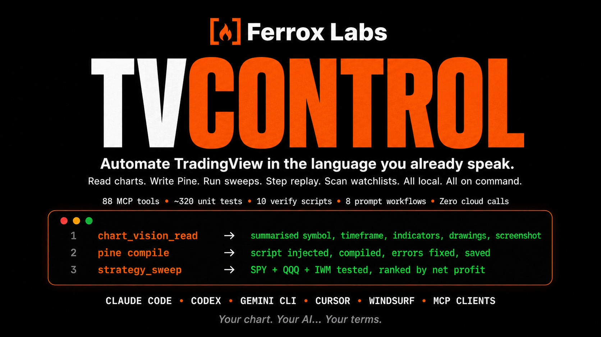

<p align="center">
  
</p>

# TVControl

### TradingView MCP System · by [Ferrox Labs](https://github.com/ferroxlabs)

> **Tell your AI what you want from your TradingView chart. Watch it happen on screen.**

TVControl turns your TradingView Desktop into something you can talk to. You type a sentence (*"summarise this chart"*, *"sweep this strategy across SPY, QQQ and IWM on 5m and 15m"*, *"step through last March bar by bar and call out the breakout"*) and the AI reads, clicks, types, compiles and screenshots inside the actual TradingView app on your machine. No copy-paste. No screen-share to the cloud. Nothing leaves your computer.

It works because every Chromium app, TradingView Desktop included, ships with a built-in debugging interface (the same one Chrome uses to debug itself). TVControl speaks that interface on your behalf, exposing **88 chart-control tools** to any AI agent that supports the Model Context Protocol (Claude Code, Codex, Gemini CLI, Cursor, and others). Pair-program in Pine Script. Optimize parameter grids. Snapshot and restore whole chart setups. Drive 4-pane layouts. Step through replay. Scan a watchlist. All by speech-to-action.

**88 MCP tools · ~320 unit tests · 10 verify scripts · 8 prompt-library workflows · zero cloud calls.** Everything in this repo is real, tested, and used daily.

---

## What it actually does (with prompts that work)

Paste any of these into Claude Code (or your MCP-compatible agent of choice) once TVControl is wired up.

**Read your chart in one prompt.**
> *Use `chart_vision_read` to summarise my chart: symbol, timeframe, last price, visible indicators with their current values, custom Pine levels and labels, and the last 100-bar move.*

A single tool call returns symbol, timeframe, indicator values, custom Pine drawings, OHLCV summary, and a screenshot. Roughly 5 to 10 KB back instead of ~80 KB across five separate calls.

**Pair-program in Pine Script.**
> *Write me a Pine v6 indicator that plots a 20-period EMA in blue and a 50-period EMA in orange, then compile it on my chart. Fix any errors. Save it as "EMA Cross".*

Inject, server-side compile, read errors, fix, save. The compiler errors come back to the agent directly, so iteration is seconds, not minutes.

**Optimize a parameter grid.**
> *Use `strategy_sweep` to test my current strategy across [`SPY`, `QQQ`, `IWM`] on `5` and `15` with `length` of 10, 14, 20 and `multiplier` of 1.5, 2, 2.5. Rank by net profit.*

Cartesian product, 24h-TTL disk cache (re-runs are near-instant), optional `parallelism: N` worker tabs, resume-from-partial. Caps at 500 combinations.

**Snapshot a setup. Restore it later.**
> *Snapshot my current chart as "morning-prep". Switch to BTCUSDT 4h with VWAP and Bollinger Bands. Done? Restore "morning-prep".*

Captures symbol, timeframe, all studies and their inputs, drawings, and the full `metaInfo` blob for published Pine, even ones that normally won't reload.

**Practice with replay.**
> *Start replay at 2025-03-10 09:30 ET. Step through the open. Call out any breakouts on the 1-min and simulate the entry. Show me the running P&L.*

**Scan a watchlist.**
> *For every symbol in my watchlist, take a 1-day chart screenshot, read the RSI(14), and rank by overbought-to-oversold.*

The full prompt library (every workflow above plus chart analysis, watchlist and alerts, screening, and agent prompting tips) lives in [`examples/prompts/`](./examples/prompts/). Eight files. Copy-pasteable.

---

## How it stays grounded (the proof)

This isn't a demo. It ships with a test battery.

- **~320 offline unit tests** across 16 files: Pine analyzer, sanitization, replay, watchlist, alerts, state snapshots, sweep planning, vision wrapper, telemetry, tool registration, CLI routing.
- **10 end-to-end verify scripts** under [`examples/verify/`](./examples/verify/) that drive the same MCP tools through the `tv` CLI against a live TradingView. Run `examples/verify/run-all.sh` and it auto-skips when TV isn't up.
- **GitHub Actions CI** runs the offline suite on Node 18, 20, and 22 on every push.
- **CDP smoke** (`scripts/smoke.sh`): live connection sanity check against your local TradingView.

```bash
npm test                                    # offline suite
./examples/verify/00-verify-install.sh      # offline install check
./examples/verify/run-all.sh                # full live battery
```

If your version of TradingView reshapes some internal API, the verify battery is how you'll know within seconds.

---

## Quick starts

### Path A. Claude Code, one prompt to install

Paste this into Claude Code once and let it do the rest.

> Install the TVControl MCP server. Clone https://github.com/ferroxlabs/tvcontrol.git into ~/tvcontrol, run `npm install`, add it to my Claude Code MCP config at `~/.claude/.mcp.json` as a server named `tvcontrol` pointing at `~/tvcontrol/src/server.js`, then run `tv_launch` to start TradingView in debug mode and `tv_health_check` to confirm the connection.

Claude Code will clone, install, register the server, and verify. Restart Claude Code when it finishes so the new MCP server loads.

### Path B. Manual, any MCP client

```bash
# 1. Clone and install
git clone https://github.com/ferroxlabs/tvcontrol.git
cd tvcontrol
npm install

# 2. Launch TradingView with the debug port enabled (one-time, per platform)
./scripts/launch_tv_debug_mac.sh        # macOS
./scripts/launch_tv_debug_linux.sh      # Linux
scripts\launch_tv_debug.bat             # Windows

# Or by hand on any platform:
/path/to/TradingView --remote-debugging-port=9222
```

Then add this to your MCP client config (`~/.claude/.mcp.json` for Claude Code, equivalent location for Codex / Gemini CLI / Cursor), replacing the path with your absolute path.

```json
{
  "mcpServers": {
    "tvcontrol": {
      "command": "node",
      "args": ["/absolute/path/to/tvcontrol/src/server.js"]
    }
  }
}
```

Restart your client. A copy-pasteable example config lives at [`examples/mcp-config.example.json`](./examples/mcp-config.example.json).

Verify with:
> *Use `tv_health_check`, then `chart_vision_read` to summarise my chart.*

If you get back a paragraph describing your actual chart, you're up.

### Path C. CLI only (no agent required)

Every MCP tool is also a `tv` command, JSON-out, jq-friendly. Skip the AI client entirely if you just want a programmable handle on your TradingView.

```bash
git clone https://github.com/ferroxlabs/tvcontrol.git
cd tvcontrol
npm install
npm link                          # optional: puts `tv` on your PATH

# launch TV with debug port (see Path B), then:
tv status                         # connection check
tv quote                          # latest price
tv ohlcv --summary                # compact stats
tv pine compile                   # compile current Pine on chart
tv stream quote | jq '.close'     # tick-by-tick price stream
```

---

## Examples directory map

| Workflow | File |
|----------|------|
| First 5 minutes | [`examples/prompts/00-quick-start.md`](./examples/prompts/00-quick-start.md) |
| Chart analysis | [`examples/prompts/01-chart-analysis.md`](./examples/prompts/01-chart-analysis.md) |
| Pine Script development | [`examples/prompts/02-pine-development.md`](./examples/prompts/02-pine-development.md) |
| Snapshot and restore chart state | [`examples/prompts/03-state-management.md`](./examples/prompts/03-state-management.md) |
| Strategy parameter sweeps | [`examples/prompts/04-strategy-sweep.md`](./examples/prompts/04-strategy-sweep.md) |
| Historical replay practice | [`examples/prompts/05-replay-practice.md`](./examples/prompts/05-replay-practice.md) |
| Watchlist and alerts | [`examples/prompts/06-watchlist-and-alerts.md`](./examples/prompts/06-watchlist-and-alerts.md) |
| Screening and optimization | [`examples/prompts/07-screening-and-optimization.md`](./examples/prompts/07-screening-and-optimization.md) |
| Agent prompting tips | [`examples/prompts/99-agent-tips.md`](./examples/prompts/99-agent-tips.md) |

Each prompt file lists the tools that fire, what to expect, and the common gotchas, so you can read it like a runbook before you paste, or pull it into your own automation.

---

## CLI surface

```
tv status / launch / state / symbol / timeframe / type / info / search
tv quote / ohlcv / values
tv data lines / labels / tables / boxes / strategy / trades / equity / depth / indicator
tv pine get / set / compile / analyze / check / save / new / open / list / errors / console
tv draw shape / list / get / remove / clear
tv alert list / create / delete
tv watchlist get / add / remove / export / import
tv indicator add / remove / toggle / set / get
tv layout list / switch
tv pane list / layout / focus / symbol
tv tab list / new / close / switch
tv replay start / step / stop / status / autoplay / trade
tv stream quote / bars / values / lines / labels / tables / all
tv ui click / keyboard / hover / scroll / find / eval / type / panel / fullscreen / mouse
tv screenshot / discover / ui-state / range / scroll
```

All commands return JSON. Every MCP tool has a CLI twin and vice versa.

---

## Streaming

`tv stream` polls your local TradingView Desktop over CDP and emits JSONL. No connection to TradingView's servers; all data stays on your machine.

```bash
tv stream quote                          # tick-by-tick price
tv stream bars                           # bar-by-bar updates
tv stream values                         # indicator values
tv stream lines --filter "NY Levels"     # custom Pine levels
tv stream tables --filter Profiler       # Pine table rows
tv stream all                            # all panes at once
```

> [!WARNING]
> Programmatic consumption of TradingView data may conflict with their Terms of Use regardless of how it's accessed. You are solely responsible for compliance.

---

## Architecture

```
AI Agent  <->  MCP Server (stdio)  <->  CDP (localhost:9222)  <->  TradingView Desktop (Electron)
```

- **Transport:** MCP over stdio plus a `tv` CLI exposing the same surface.
- **Connection:** Chrome DevTools Protocol on `localhost:9222`.
- **Streaming:** poll-and-diff loop with deduplication, JSONL on stdout.
- **Runtime deps:** `@modelcontextprotocol/sdk`, `chrome-remote-interface`. That's it.

The full per-tool decision tree (*which tool to call for which question*) lives in [`CLAUDE.md`](./CLAUDE.md). Read that once if you want to understand how the agent picks tools.

---

## How this stays safe to run

- The debug port is off in TradingView until *you* enable it via the standard `--remote-debugging-port=9222` flag.
- Nothing connects to TradingView's servers. The MCP server speaks CDP to the Electron app already running on your machine.
- No data is transmitted, stored, or redistributed externally by this tool.
- No real trades are executed. Chart, drawings, indicators, and Pine code only.

The same CDP interface is built into every Chromium app: VS Code, Slack, Discord, Chrome itself. It's not a side door; it's the standard debugging interface Google ships with the runtime.

---

## Compatibility

- TVControl talks to undocumented internal TradingView APIs through the Electron debug interface. Those can change in any TradingView update without notice. Pin your TradingView Desktop version if stability matters to you.
- Tested on macOS, Windows, and Linux at release time.
- Requires Node.js 18+.

---

## Disclaimer

This project is provided **for personal, educational, and research purposes only**.

By using this software, you acknowledge that:

1. You are solely responsible for ensuring your use complies with [TradingView's Terms of Use](https://www.tradingview.com/policies/) and all applicable laws.
2. TradingView's Terms of Use **restrict automated data collection, scraping, and non-display usage** of their platform and data. TVControl uses Chrome DevTools Protocol to programmatically interact with the TradingView Desktop app, which may conflict with those terms.
3. You assume all risk. Ferrox Labs and its contributors are not responsible for account bans, suspensions, legal actions, or any consequences resulting from use of this tool.
4. This tool **must not be used** for: redistributing or commercially exploiting TradingView's market data; circumventing TradingView's access controls or paywalls; performing automated live trading; violating intellectual property rights of Pine Script authors; or connecting to TradingView's servers (all access is via the locally running Desktop app).
5. Streaming functionality monitors only your local TradingView Desktop instance. It does not reach TradingView's servers.
6. Market data accessed through this tool remains subject to exchange and provider licensing terms. **Do not redistribute, store, or commercially exploit it.**

TVControl is not affiliated with, endorsed by, or associated with TradingView Inc. *TradingView* is a trademark of TradingView Inc.

If you are unsure whether your intended use complies with TradingView's terms, do not use TVControl.

---

## Acknowledgements

TVControl began as a fork of [`tradingview-mcp`](https://github.com/tradesdontlie/tradingview-mcp) by **tradesdontlie**. That project established the core CDP-bridge approach and the original tool surface, and proved the whole "drive TradingView Desktop from an MCP agent" pattern was viable.

TVControl builds on that foundation with full state snapshot and restore (including the `metaInfo` blob for published Pine), Cartesian strategy sweeps with disk memoization and parallel worker tabs, the combined `chart_vision_read` one-shot, classified-error handling with remediation hints, opt-in JSONL telemetry, an expanded offline test battery, end-to-end verify scripts, GitHub Actions CI, and a curated prompt library.

Credit for the groundwork belongs to the upstream author. If you came here looking for the original, that's [right here](https://github.com/tradesdontlie/tradingview-mcp).

---

## License

MIT. See [LICENSE](./LICENSE).

The MIT license applies to the source code of this project only. It does not grant rights to TradingView's software, data, trademarks, or other intellectual property.

---

<p align="center">
  Built and maintained by <strong><a href="https://github.com/ferroxlabs">Ferrox Labs</a></strong>.
</p>
